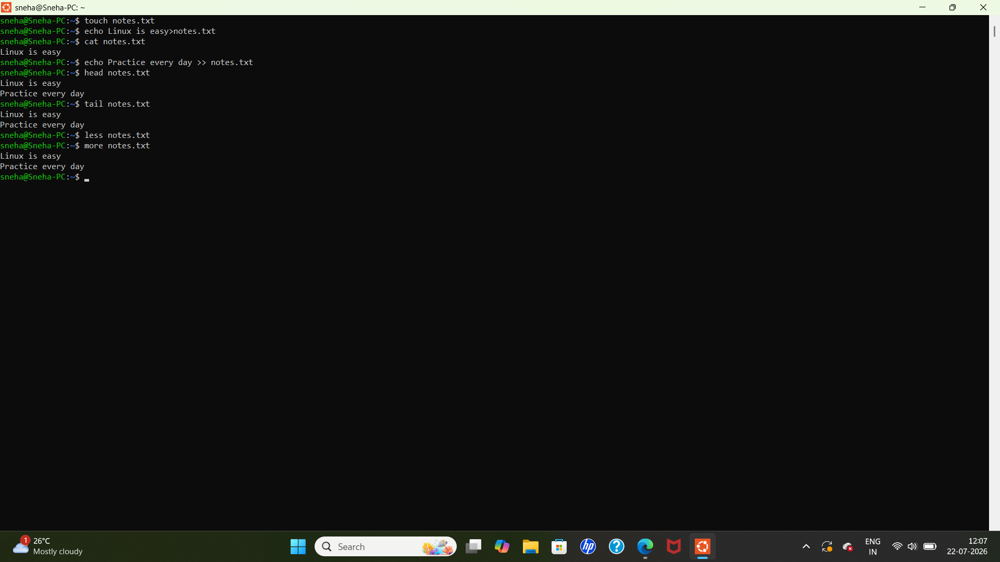

# Linux Day 3 - File Operations

## Objective
Learn basic file creation and viewing commands in Linux.

## Commands Practiced

```bash
touch notes.txt
echo Linux is easy > notes.txt
cat notes.txt
echo Practice every day >> notes.txt
head notes.txt
tail notes.txt
less notes.txt
more notes.txt
```

## Output



## Concepts Learned

- Creating files using `touch`
- Writing data using `echo`
- Appending text using `>>`
- Viewing file contents using `cat`
- Viewing first lines using `head`
- Viewing last lines using `tail`
- Reading files using `less`
- Reading files using `more`


