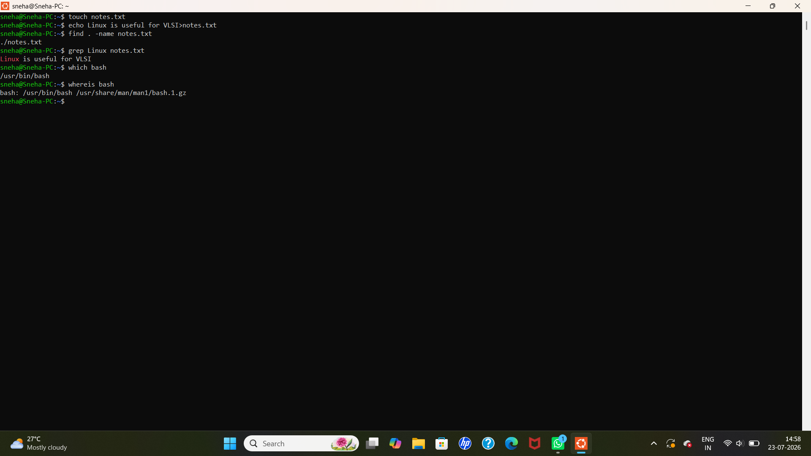

# Linux Day 4 - File Search and Command Information

## Objective
Learn basic Linux commands for searching files, searching text, and locating command information.

## Commands Practiced

```bash
touch notes.txt
echo Linux is useful for VLSI > notes.txt
find . -name notes.txt
grep Linux notes.txt
which bash
whereis bash
```

## Output



## Concepts Learned

- Creating a file using `touch`
- Writing text into a file using `echo`
- Searching for a file using `find`
- Searching for specific text using `grep`
- Finding the executable path of a command using `which`
- Finding the binary and manual page locations using `whereis`

## Author

Sneha S
