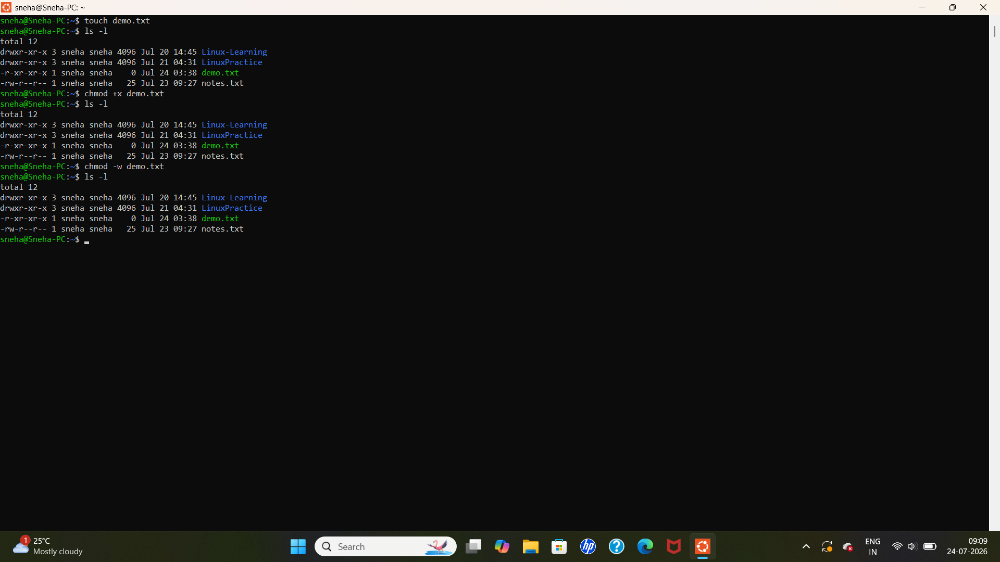

# Linux Day 5 - File Permissions

## Objective
Learn how to view and modify file permissions in Linux using the `chmod` command.

## Commands Practiced

```bash
touch demo.txt
ls -l
chmod +x demo.txt
ls -l
chmod -w demo.txt
ls -l
```

## Output



## Concepts Learned

- Creating a file using `touch`
- Viewing file permissions using `ls -l`
- Adding execute permission using `chmod +x`
- Removing write permission using `chmod -w`
- Verifying permission changes using `ls -l`


