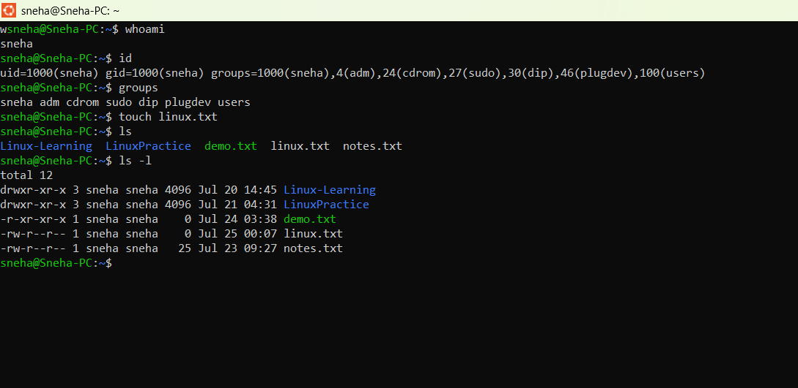

# Linux Day 6 - User Information and File Creation

## Objective
Learn basic Linux commands to check user information and create files.

## Commands Practiced

```bash
whoami
id
groups
touch linux.txt
ls -l
```

## Output



## Concepts Learned

- Checking the current logged-in user using `whoami`
- Viewing user ID (UID), group ID (GID), and user groups using `id`
- Displaying all groups of the current user using `groups`
- Creating an empty file using `touch`
- Viewing detailed file information using `ls -l`

