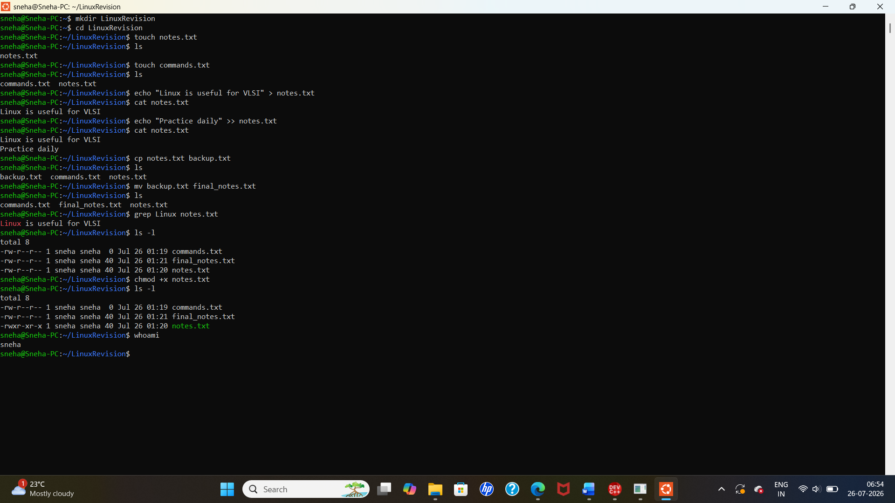

# Linux Mini Challenge – File & Directory Operations

## 📌 Objective

Practice essential Linux commands for creating directories, managing files, writing text, copying, renaming, searching, changing permissions, and checking the current user.

---

## 🛠️ Commands Used

| Command | Description |
|---------|-------------|
| `mkdir` | Create a new directory |
| `cd` | Change the current directory |
| `touch` | Create an empty file |
| `echo` | Write text into a file |
| `cat` | Display file contents |
| `cp` | Copy a file |
| `mv` | Rename or move a file |
| `grep` | Search for text in a file |
| `ls -l` | Display detailed file information |
| `chmod` | Change file permissions |
| `whoami` | Display the current logged-in user |

---

## 🚀 Steps Performed

### 1. Create a directory

```bash
mkdir LinuxRevision
```

### 2. Navigate into the directory

```bash
cd LinuxRevision
```

### 3. Create two files

```bash
touch notes.txt
touch commands.txt
```

### 4. Write text into a file

```bash
echo "Linux is useful for VLSI" > notes.txt
```

### 5. Append another line

```bash
echo "Practice daily" >> notes.txt
```

### 6. Display file contents

```bash
cat notes.txt
```

### 7. Copy the file

```bash
cp notes.txt backup.txt
```

### 8. Rename the copied file

```bash
mv backup.txt final_notes.txt
```

### 9. Search for the word "Linux"

```bash
grep Linux notes.txt
```

### 10. View file permissions

```bash
ls -l
```

### 11. Add execute permission

```bash
chmod +x notes.txt
```

### 12. Check the current user

```bash
whoami
```

---

## 📋 Expected Output

### `cat notes.txt`

```text
Linux is useful for VLSI
Practice daily
```

### `grep Linux notes.txt`

```text
Linux is useful for VLSI
```

### `ls -l`

```text
-rwxr-xr-x notes.txt
-rw-r--r-- commands.txt
-rw-r--r-- final_notes.txt
```

### `whoami`

```text
your_username
```

---

## 📷 Output Screenshot

The screenshot below shows the successful execution of the Linux Mini Challenge.



---

## 🎯 Skills Learned

- Creating directories
- Navigating directories
- Creating files
- Writing and appending text
- Displaying file contents
- Copying files
- Renaming files
- Searching text using `grep`
- Viewing file permissions
- Changing file permissions
- Checking the current logged-in user

---

## ✅ Conclusion

This mini challenge demonstrates the basic Linux commands required for file and directory management. Completing this exercise strengthens your understanding of Linux fundamentals, which are essential for software development, Embedded Systems, DevOps, and VLSI workflows.
