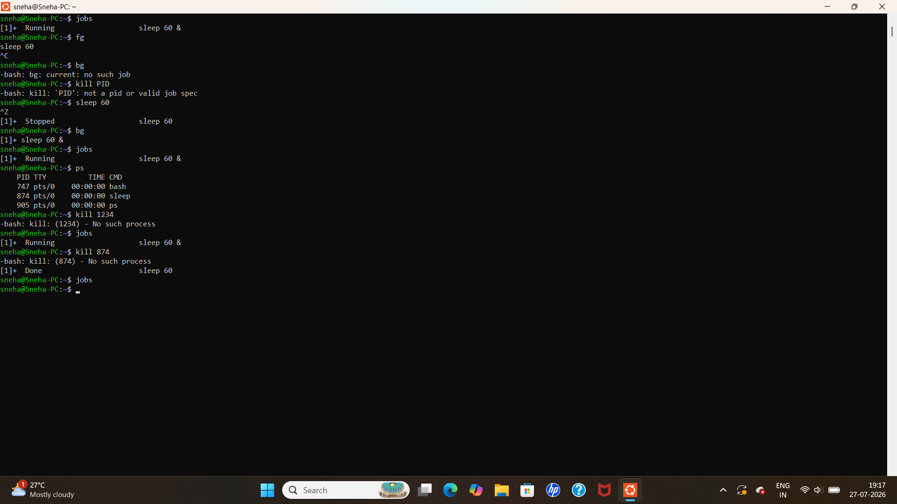

# Linux Process Management

## Aim

To learn basic Linux process management commands such as viewing processes, monitoring the system, managing background jobs, and terminating processes.

---

## Commands Used

### 1. View Current Processes

```bash
ps
```

### Output


---

### 2. View All Running Processes

```bash
ps -e
```

### Output


---

### 3. Monitor the System

```bash
top
```

### Output


Press **q** to exit.

---

### 4. View Background Jobs

```bash
jobs
```

### Output


---

### 5. Run a Process in the Background

```bash
sleep 60 &
```

### Output


---

### 6. Bring the Background Job to the Foreground

```bash
fg
```

### Output


---

### 7. Stop the Foreground Process

Press:

```text
Ctrl + C
```

### Output


---

### 8. Suspend a Running Process

Press:

```text
Ctrl + Z
```

### Output


---

### 9. Resume a Stopped Job in the Background

```bash
bg
```

### Output



---

### 10. Kill a Process

```bash
kill <PID>
```

Example:

```bash
kill 874
```

### Output


---

## Result

Successfully learned and executed Linux Process Management commands in Ubuntu Linux.
