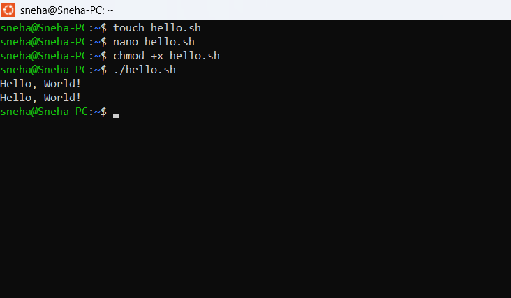

# Linux Master Course – Day 12: Bash Variables

## Commands

```bash
touch variables.sh
nano variables.sh
chmod +x variables.sh
./variables.sh
```

## Script

```bash
#!/bin/bash

name="Sneha"
college="UBDTCE"

echo "Name: $name"
echo "College: $college"
```

## Output

```text
Name: Sneha
College: UBDTCE
```

## Output Screenshot


