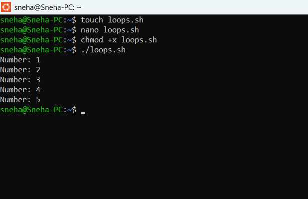

# Day 13 Practice – Bash For Loop

## Objective
Learn how to create and execute a Bash script using a `for` loop.

## Step 1: Create a Bash Script

```bash
touch loops.sh
```

## Step 2: Open the Script

```bash
nano loops.sh
```

## Step 3: Write the Program

```bash
#!/bin/bash

for i in 1 2 3 4 5
do
    echo "Number: $i"
done
```

## Step 4: Save the File

- Press `Ctrl + O`
- Press `Enter`
- Press `Ctrl + X`

## Step 5: Give Execute Permission

```bash
chmod +x loops.sh
```

## Step 6: Run the Script

```bash
./loops.sh
```

## Output
## Output Screenshot



## What I Learned

- Creating a Bash script using `touch`
- Editing a script with `nano`
- Writing a `for` loop in Bash
- Giving execute permission using `chmod +x`
- Running a Bash script using `./script_name`
