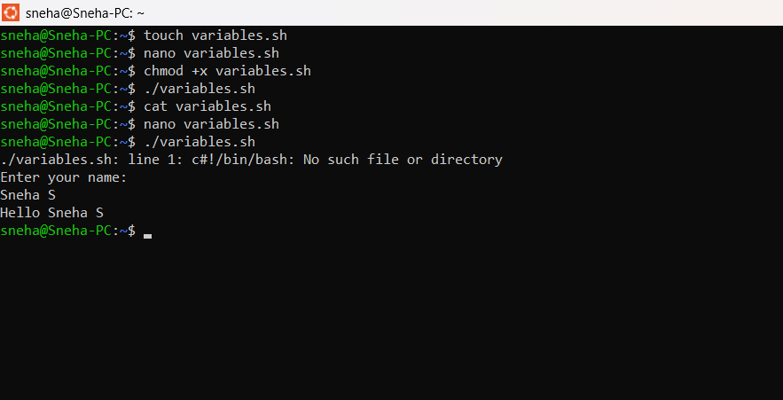

# Bash Script – User Input Using Variables

## Objective

Learn how to accept user input in a Bash script using the `read` command.

---

## Program

```bash
#!/bin/bash

echo "Enter your name:"
read name

echo "Hello $name"
```

---

## How to Run

```bash
touch variables.sh
nano variables.sh
chmod +x variables.sh
./variables.sh
```

---

## Sample Output

```text
Enter your name:
Sneha
Hello Sneha
```

---

## Output Screenshot




## Commands Used

```bash
touch variables.sh
nano variables.sh
chmod +x variables.sh
./variables.sh
```

---

## What I Learned

* Creating a Bash script
* Accepting user input using `read`
* Displaying variables with `$`
* Making a script executable using `chmod +x`
* Running a Bash script
